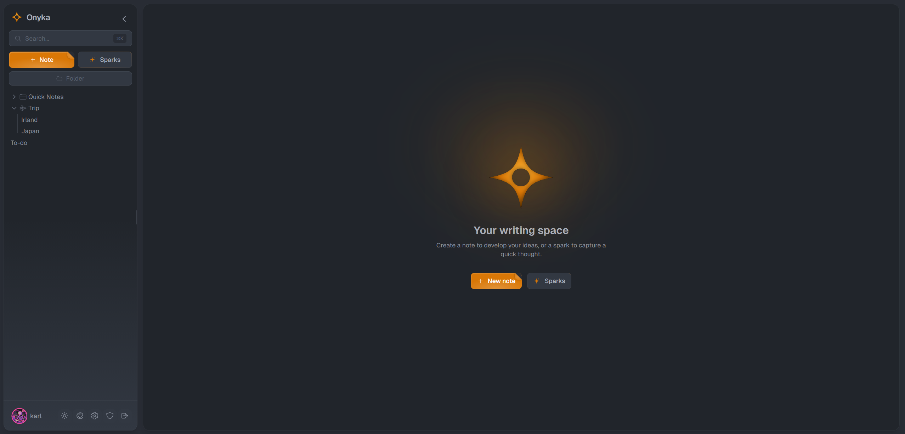

<p align="center">
  
</p>

<h1 align="center">Onyka</h1>

<p align="center">
  <strong>Write it down. Own it forever.</strong>
  <br />
  An open-source, self-hosted note app. SQLite, AES-256-GCM encryption at rest, real-time collab. Docker or Node.js.
</p>

<p align="center">
  <a href="#install">Install</a> ·
  <a href="#features">Features</a> ·
  <a href="#configuration">Configuration</a> ·
  <a href="#backup--restore">Backup</a> ·
  <a href="#reverse-proxy">Reverse Proxy</a>
</p>

<p align="center">
  
  
  
  
  <a href="https://deepwiki.com/karl-cta/onyka"></a>
</p>

---

<p align="center">
  
</p>

---

## Why Onyka?

Note apps keep growing sideways — databases, kanban boards, plugins, AI assistants. Onyka grows inward.

It's a self-hosted, open-source note app built entirely in TypeScript. Deploy with Docker or install with Node.js. One SQLite database, no external services. Your content is encrypted at rest with AES-256-GCM. There is no telemetry.

Sparks lets you capture thoughts in one keystroke with configurable expiration — what doesn't get promoted to a note simply disappears. Real-time collaboration, focus mode with Pomodoro timer, 135+ theme combinations, and a full admin console are built into the core, not bolted on.

Fewer things. Done well.

---

## Install

### Docker (recommended)

```bash
docker run -d --name onyka -p 3000:3000 -v onyka-data:/app/data ghcr.io/karl-cta/onyka:latest
```

Or with Docker Compose:

```bash
curl -O https://raw.githubusercontent.com/karl-cta/onyka/main/docker/docker-compose.yml
docker compose up -d
```

Open **http://localhost:3000** — that's it.

No `.env` file, no secrets to generate, no configuration. Everything is auto-generated on first launch. The first user to register becomes admin.

### Node.js

Requires Node.js 20+ and pnpm 10+.

```bash
git clone https://github.com/karl-cta/onyka.git && cd onyka
pnpm install
pnpm build
pnpm start:prod  # → http://localhost:3001
```

Secrets are auto-generated on first start. No `.env` required.

To customize (SMTP, CORS, etc.):

```bash
cp apps/server/.env.example apps/server/.env
# Edit apps/server/.env with your settings
```

### What happens on first start?

All your data lives in one folder (`data/`):

```
data/
├── onyka.db          ← database (notes, users, settings)
├── uploads/          ← images (encrypted at rest, same as notes)
├── .encryption-key   ← AES-256-GCM key (auto-generated)
├── .jwt-secret       ← JWT signing key (auto-generated)
└── backups/          ← backup archives
```

Secrets are auto-generated and persisted. Back up this folder and you're safe. **Without `.encryption-key`, encrypted data (notes + images) is permanently lost.**

---

## Features

### Sparks

Type → Enter → Captured. No title, no folder. Expiration: 1h–30d or permanent. Pin up to 5. Convert when it matters, the rest disappears.

### Rich Editor

TipTap 3.19. Code blocks, tables, columns, images, slash menu. Auto-save. Markdown paste. Note pages (tabs inside a single note).

### Real-Time Collab

WebSocket co-editing. Live presence. Threaded comments. 3 permission levels.

### Focus Mode

Pomodoro (1–180 min). Word counter. Streaks. Weekly recap. Sidebar hidden, zero distractions.

### Themes

9 bases (Dracula, Nord, Tokyo Night, One Dark, GitHub, Catppuccin Latte, Rosé Pine Dawn, Paper, Default) × 15 accents × 12 editor fonts. Dark/light mode. Bilingual (EN/FR, 750+ keys).

### Organization

Folders with drag & drop, tags (AND/OR/NOT filtering), full-text search, 30-day trash with restore.

### Security

AES-256-GCM at rest. Argon2id. JWT + HttpOnly refresh. Email 2FA. Rate limiting. Zero telemetry.

### PWA

Install from your browser on any device. No app store required.

---

## Configuration

No configuration is required. All secrets are auto-generated on first launch.

Optional environment variables (set in Docker Compose or `.env`):

| Variable | Description | Default |
|----------|-------------|---------|
| `CORS_ORIGIN` | Allowed CORS origins | `http://localhost:5173` |
| `FRONTEND_URL` | Public URL (used in emails) | `http://localhost:5173` |
| `TRUST_PROXY` | Set to `1` behind a reverse proxy | — |
| `SMTP_HOST` | SMTP server for emails (2FA, password reset) | — |
| `SMTP_PORT` | SMTP port | `587` |
| `SMTP_USER` | SMTP username | — |
| `SMTP_PASS` | SMTP password | — |
| `SMTP_FROM` | Email sender | `Onyka <noreply@onyka.app>` |

Without SMTP, email features (2FA, password reset, email verification) are disabled automatically.

To override auto-generated secrets, pass `JWT_SECRET` or `ENCRYPTION_KEY` as environment variables — they take priority over the persisted files.

See [`apps/server/.env.example`](apps/server/.env.example) for the full list.

---

## Backup & Restore

### Backup

```bash
# Node.js
pnpm db:backup
# → data/backups/onyka-2026-02-15_14-30-00.tar.gz

# Docker
docker exec onyka node scripts/backup.js
docker cp onyka:/app/data/backups/ .
```

The `.tar.gz` archive contains everything: database + uploads + encryption keys. One file to save.

### Restore

```bash
tar -xzf onyka-backup.tar.gz -C /path/to/data/
# Restart Onyka
```

### Migrate to another server

```bash
# Old server
scp -r data/ user@new-server:/path/to/onyka/data/

# New server
docker compose up -d
```

One folder. That's it.

---

## Reverse Proxy

Onyka listens on HTTP. For production, place it behind a reverse proxy for HTTPS. Set `TRUST_PROXY=1` so rate limiting uses the real client IP.

### Caddy (simplest — automatic HTTPS)

```
notes.example.com {
    reverse_proxy localhost:3000
}
```

### Nginx

```nginx
server {
    listen 443 ssl;
    server_name notes.example.com;

    ssl_certificate /etc/letsencrypt/live/notes.example.com/fullchain.pem;
    ssl_certificate_key /etc/letsencrypt/live/notes.example.com/privkey.pem;

    # Compression — strongly recommended, reduces bundle size by ~70%
    gzip on;
    gzip_vary on;
    gzip_proxied any;
    gzip_comp_level 6;
    gzip_min_length 1000;
    gzip_types text/plain text/css application/json application/javascript
               text/xml application/xml application/xml+rss text/javascript
               image/svg+xml;

    # Cache static assets (JS/CSS have hashed filenames, safe to cache long)
    location ~* \.(js|css|png|jpg|jpeg|gif|ico|svg|woff|woff2|ttf|eot)$ {
        proxy_pass http://localhost:3000;
        proxy_set_header Host $host;
        expires 30d;
        add_header Cache-Control "public, immutable";
    }

    # API, pages & WebSocket
    location / {
        proxy_pass http://localhost:3000;
        proxy_http_version 1.1;
        proxy_set_header Upgrade $http_upgrade;
        proxy_set_header Connection "upgrade";
        proxy_set_header Host $host;
        proxy_set_header X-Real-IP $remote_addr;
        proxy_set_header X-Forwarded-For $proxy_add_x_forwarded_for;
        proxy_set_header X-Forwarded-Proto $scheme;
    }
}
```

> **Important:** The `gzip` and caching directives make a significant difference — without them, the full uncompressed JS bundle is re-downloaded on every page load. The `Upgrade` and `Connection` headers are required for WebSocket (real-time collaboration).

### Cloudflare Tunnel

```bash
cloudflared tunnel --url http://localhost:3000
```

---

## Development

```bash
pnpm dev          # Frontend (localhost:5173) + backend (localhost:3001)
pnpm build        # Build all packages
pnpm lint         # ESLint
pnpm typecheck    # TypeScript checks
pnpm test         # Run tests
```

See [CONTRIBUTING.md](CONTRIBUTING.md) for the full development workflow.

---

## Tech Stack

| Layer | Technologies |
|-------|-------------|
| **Frontend** | React 19, Vite 6, TypeScript, Zustand, TipTap 3, Tailwind CSS, Framer Motion, Socket.io |
| **Backend** | Express 4, Drizzle ORM, better-sqlite3, Socket.io, Argon2, jose (JWT), Zod, Helmet |
| **Infrastructure** | Docker (multi-stage, Alpine, non-root), pnpm monorepo |

---

## License

[AGPL-3.0](LICENSE) — Self-hosted is free forever with all features.
